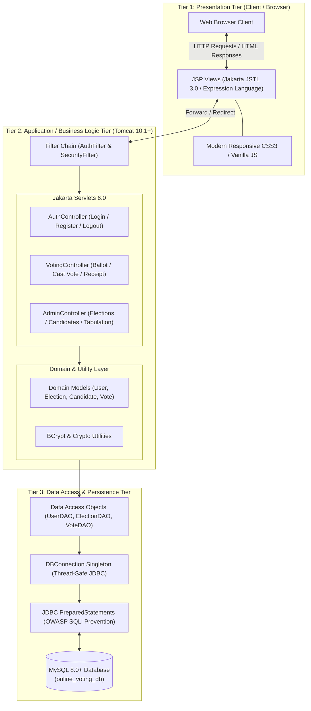
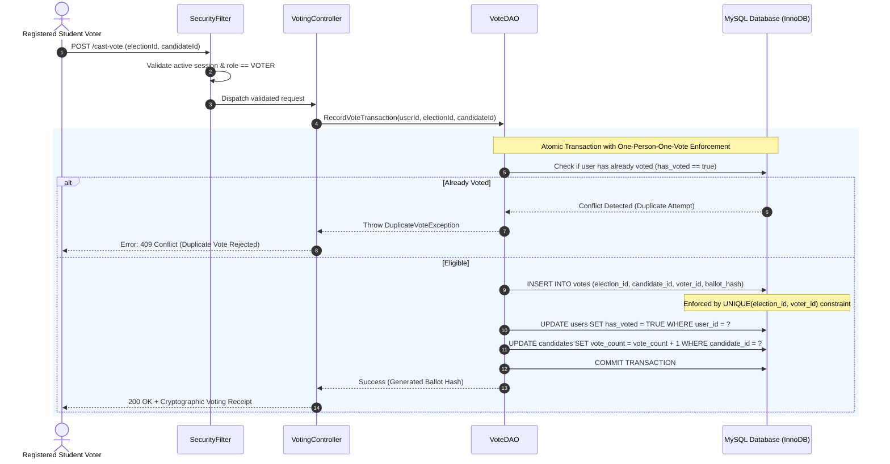
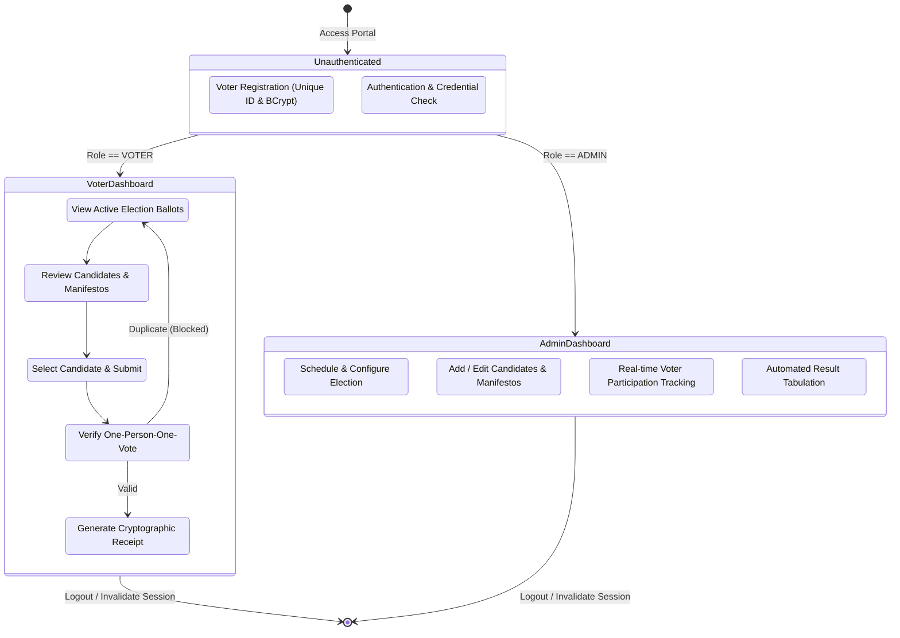

# Online Voting System

[](https://www.oracle.com/java/technologies/javase/jdk17-archive-downloads.html)
[-1A5276?style=for-the-badge&logo=eclipse&logoColor=white)](https://jakarta.ee/)
[](https://tomcat.apache.org/)
[](https://www.mysql.com/)
[](https://maven.apache.org/)
[](LICENSE)

> **Academic Submission:** Full Stack Java Programming (FSJP) Micro-Project  
> **Target Environment:** Java SE 17 LTS | Jakarta EE 10 | Apache Tomcat 10.1+ | MySQL 8.0+

---

## 1. Project Title & Overview

The **Online Voting System (OVS)** is an enterprise-grade, secure, web-based electronic voting platform designed specifically for institutional environments such as university student councils, faculty senates, student unions, and campus club elections.

### Institutional Motivation & Objectives
Traditional paper-based campus elections face operational inefficiencies, including high administrative overhead, human tabulation errors, delayed declaration of outcomes, and vulnerability to ballot tampering. Conversely, naive digital polling tools lack strong cryptographic protections, fail to separate voter identity from cast ballots, and risk coercion or double-voting.

This project implements a rigorous **3-Tier Model-View-Controller (MVC)** institutional web application designed to satisfy essential democratic election properties:
- **Electoral Integrity:** Enforcing strict one-person-one-vote rules through database constraints and transactional validation.
- **Ballot Secrecy & Privacy:** Cryptographic separation of voter identification tokens from actual vote choices.
- **Auditability & Verifiability:** Digital voter receipts containing SHA-256 cryptographic hashes for end-to-end receipt confirmation.
- **Role-Based Access Control (RBAC):** Strict separation between student voters and election administrators.
- **Instant Tabulation:** Real-time, automated tallying upon election window closure.

---

## 2. Key Architectural Highlights

The system strictly adheres to the classical **3-Tier Model-View-Controller (MVC)** architectural design pattern, ensuring strong decoupling of user interface concerns, enterprise business logic, and persistent relational storage.



### Technology Stack Specifications

| Layer / Aspect | Technology / Library | Version | Description & Role |
| :--- | :--- | :--- | :--- |
| **Language Runtime** | Java Platform, Standard Edition (Java SE) | **17 LTS** | Modern JVM with pattern matching, sealed records, and enhanced security primitives. |
| **Servlet Specification** | Jakarta Servlet API | **6.0.0** | Core web controller foundation running on Jakarta EE 10 namespace (`jakarta.*`). |
| **Templating Engine** | Jakarta Server Pages (JSP) & JSTL | **3.0.0 / 3.0.1** | Dynamic server-side page rendering with zero scriptlets (`c:if`, `c:forEach`). |
| **Web Container** | Apache Tomcat | **10.1.x** | Enterprise-grade Jakarta EE 10 compliant servlet container. |
| **Database Engine** | MySQL Community Server | **8.0+** | ACID-compliant relational database engine with InnoDB storage and `utf8mb4` encoding. |
| **Persistence Driver** | MySQL Connector/J | **8.3.0** | Type-4 pure Java JDBC driver for database connectivity. |
| **Cryptography** | jBCrypt | **0.4** | Adaptive Blowfish-based key derivation function for voter password hashing. |
| **Build Automation** | Apache Maven | **3.8+** | Dependency lifecycle management and `.war` compilation. |

---

## 3. Security Design

Security is fundamental to the architecture of the Online Voting System. The application implements defense-in-depth principles across authentication, session management, query execution, and ballot confidentiality.



### 1. Password Hashing via BCrypt
- User passwords are **never stored in plaintext**.
- Utilizes the `jBCrypt` library implementing the OpenBSD Blowfish password-hashing algorithm (`$2a$10$...`).
- Generates a unique 128-bit cryptographically secure pseudorandom salt per user, automatically integrated into the resulting 60-character hash string.
- Resistant against rainbow table precomputation, GPU-accelerated hashing, and dictionary attacks.

### 2. Session Management & Role-Based Access Control (RBAC)
- Authenticated user contexts are bound to a server-managed `HttpSession`.
- Cookies are provisioned with strict attributes configured in [`web.xml`](file:///c:/Users/admin/Desktop/Online%20Voting%20System/Online_Voting_System/src/main/webapp/WEB-INF/web.xml):
  - **`HttpOnly=true`**: Restricts client-side JavaScript access via `document.cookie`, mitigating Cross-Site Scripting (XSS) session theft.
  - **`session-timeout=30`**: Sessions automatically expire after 30 minutes of inactivity.
- URL-level filtering ensures that voters cannot access administrative routes (`/admin/*`) and unauthenticated users are redirected to the login gateway.

### 3. OWASP SQL Injection (SQLi) Prevention
- Complete avoidance of dynamic SQL query concatenation (`"SELECT * FROM users WHERE email = '" + input + "'"`).
- All database operations are executed strictly through **JDBC `PreparedStatement`** interfaces with strongly typed parameter bindings:
  ```java
  String sql = "SELECT user_id, password_hash, role, status FROM users WHERE email = ?";
  try (Connection conn = DBConnection.getConnection();
       PreparedStatement pstmt = conn.prepareStatement(sql)) {
      pstmt.setString(1, email);
      try (ResultSet rs = pstmt.executeQuery()) {
          // Process secure result set
      }
  }
  ```
- Implements the Java 7+ `try-with-resources` idiom to eliminate JDBC connection, statement, and cursor resource leaks.

### 4. Separation of Voter Identities & Ballot Privacy
- To preserve the democratic secret ballot:
  1. The `votes` table decouples personal voter profile fields (name, department, email) from candidate selection.
  2. Each vote transaction generates a one-way **cryptographic ballot hash** (`SHA-256(voter_id + election_id + timestamp + salt)`), which is returned to the student as an immutable proof-of-vote receipt.
  3. Database-level constraints (`CONSTRAINT uk_voter_election UNIQUE (election_id, voter_id)`) guarantee that no voter can cast more than one ballot in a given election, even in the event of concurrent requests.

---

## 4. Database Setup

The database schema and sample seed records are maintained in [`sql/schema.sql`](file:///c:/Users/admin/Desktop/Online%20Voting%20System/Online_Voting_System/sql/schema.sql).

### Step 1: Execute Schema in MySQL Workbench or CLI

#### Option A: Using MySQL Workbench (GUI)
1. Launch **MySQL Workbench** and connect to your local MySQL server instance (`localhost:3306`).
2. Navigate to **File** &rarr; **Open SQL Script...** (or press `Ctrl + Shift + O`).
3. Select the file: `sql/schema.sql` located inside the root project directory.
4. Click the **Execute** button (the lightning icon ⚡) to run the script.
5. In the **Schemas** panel on the left, right-click and select **Refresh All**; verify that `online_voting_db` is created with tables: `users`, `elections`, `candidates`, and `votes`.

#### Option B: Using MySQL Command Line Client
Open PowerShell or your command terminal and execute:
```bash
# Log in to MySQL server and execute schema
mysql -u root -p < "c:\Users\admin\Desktop\Online Voting System\Online_Voting_System\sql\schema.sql"
```

### Step 2: Database Schema Overview

```
+-----------------------------------------------------------------------+
|                           online_voting_db                            |
+-----------------------------------------------------------------------+
|  users                                                                |
|  ├── user_id (INT PK, AI)                                             |
|  ├── voter_id_card (VARCHAR UNIQUE)  <-- Student / National ID       |
|  ├── full_name (VARCHAR)                                              |
|  ├── email (VARCHAR UNIQUE)                                           |
|  ├── password_hash (VARCHAR)         <-- BCrypt Salted Hash           |
|  ├── role (ENUM: 'ADMIN', 'VOTER')                                    |
|  ├── has_voted (BOOLEAN)                                              |
|  └── status (ENUM: 'PENDING', 'ACTIVE', 'BLOCKED')                    |
+-----------------------------------------------------------------------+
                                   | 1
                                   |
                                   | N
+----------------------------------+----+   +---------------------------+
|  votes                                |   |  elections                |
|  ├── vote_id (INT PK, AI)             |   |  ├── election_id (PK, AI) |
|  ├── election_id (INT FK) ------------+---+->├── title (VARCHAR)      |
|  ├── candidate_id (INT FK) -------+   |   |  ├── start_time (DATETIME)|
|  ├── voter_id (INT FK)            |   |   |  ├── end_time (DATETIME)  |
|  ├── cast_at (TIMESTAMP)          |   |   |  └── status (ENUM)        |
|  └── ballot_hash (VARCHAR)        |   |   +---------------------------+
|  [*] UNIQUE(election_id, voter_id)|   |                 | 1
+-----------------------------------+   |                 |
                                        |                 | N
                                        |   +-------------+-------------+
                                        |   |  candidates               |
                                        +-->|  ├── candidate_id (PK, AI)|
                                            |  ├── election_id (INT FK) |
                                            |  ├── full_name (VARCHAR)  |
                                            |  ├── party_name (VARCHAR) |
                                            |  ├── symbol_name (VARCHAR)|
                                            |  └── vote_count (INT)     |
                                            +---------------------------+
```

### Step 3: Default Seed Accounts for Testing

| Role | Username / Voter ID | Email | Default Password | Initial Status |
| :--- | :--- | :--- | :--- | :--- |
| **System Administrator** | `ADMIN-001` | `admin@voting.system` | `AdminPassword123!` | `ACTIVE` |
| **Election Candidate #1**| *Alice Johnson* | Progressive Alliance | Symbol: `Torch` | Registered in Election #1 |
| **Election Candidate #2**| *Bob Martinez* | United Reform Coalition| Symbol: `Eagle` | Registered in Election #1 |

### Step 4: Configure Database Connection ([`DBConnection.java`](file:///c:/Users/admin/Desktop/Online%20Voting%20System/Online_Voting_System/src/main/java/com/ovs/config/DBConnection.java))

Database connection properties are managed via a Singleton pattern in `com.ovs.config.DBConnection`. The class supports runtime overrides via environment variables or default constants:

```java
private static final String URL = "jdbc:mysql://localhost:3306/online_voting_db?useSSL=false&allowPublicKeyRetrieval=true&serverTimezone=UTC";
private static final String USER = System.getenv("DB_USER") != null ? System.getenv("DB_USER") : "root";
private static final String PASSWORD = System.getenv("DB_PASSWORD") != null ? System.getenv("DB_PASSWORD") : "Raihaanarif1@";
```

#### Adjusting Credentials
If your MySQL `root` password differs from `Raihaanarif1@`, you can either:
1. **Set Environment Variables (Recommended):**
   ```powershell
   $env:DB_USER="root"
   $env:DB_PASSWORD="YourMySqlPassword"
   ```
2. **Edit [`DBConnection.java`](file:///c:/Users/admin/Desktop/Online%20Voting%20System/Online_Voting_System/src/main/java/com/ovs/config/DBConnection.java#L13-L16)** directly before building.

#### Quick Database Verification
Test the database connection without launching Tomcat by executing the built-in `main` diagnostic method:
```powershell
# Compile the project classes
mvn compile

# Execute the DBConnection verification routine
java -cp "target/classes;target/online-voting-system/WEB-INF/lib/*" com.ovs.config.DBConnection
```

---

## 5. Build & Deployment Instructions

### Prerequisites Checklist
Before compiling and deploying the application, ensure the following tools are installed and present on your system `PATH`:
- **Java Development Kit (JDK):** Version 17 LTS or higher (`java -version`)
- **Apache Maven:** Version 3.8.0 or higher (`mvn -version`)
- **Apache Tomcat:** Version 10.1.x (`Tomcat 10.1+` is mandatory for Jakarta EE 10 / Servlet 6.0 support; Tomcat 9 and older will fail due to `javax.*` namespace incompatibilities)
- **MySQL Community Server:** Version 8.0 or higher (`mysql --version`)

---

### Step-by-Step Build Commands

#### 1. Clean and Package via Maven
Open a terminal in the project root directory and execute:
```bash
mvn clean package
```

Upon successful compilation and packaging, Maven creates the WAR artifact:
```
[INFO] Packaging webapp
[INFO] Building war: ...\target\online-voting-system.war
[INFO] BUILD SUCCESS
```

---

### Deploying to Apache Tomcat 10.1+

#### Method 1: Direct File Copy Deployment (Standard)
1. Stop your Apache Tomcat instance if it is currently running:
   - Windows: `%CATALINA_HOME%\bin\shutdown.bat`
   - Linux / macOS: `$CATALINA_HOME/bin/shutdown.sh`
2. Copy the generated WAR file:
   - **Source:** `target/online-voting-system.war`
   - **Destination:** `%CATALINA_HOME%\webapps\` (e.g., `C:\Program Files\Apache Software Foundation\Tomcat 10.1\webapps\`)
3. Start the Apache Tomcat server:
   - Windows: `%CATALINA_HOME%\bin\startup.bat`
   - Linux / macOS: `$CATALINA_HOME/bin/startup.sh`
4. Tomcat will automatically unpack the WAR into an expanded folder named `online-voting-system`.

#### Method 2: Deployment via Tomcat Web Manager
1. Navigate to `http://localhost:8080/manager/html` in your browser.
2. Under the **WAR file to deploy** section, click **Browse...** and select `target/online-voting-system.war`.
3. Click **Deploy**.

---

### Accessing the Web Application
Once deployed, open any modern web browser and navigate to:
```
http://localhost:8080/online-voting-system/
```

> **Note on Root Deployment:** If you wish to access the application directly at `http://localhost:8080/`, rename the archive to `ROOT.war` prior to copying it into `%CATALINA_HOME%\webapps\`.

---

## 6. Core Workflow / Features

The system provides separate operational workflows for institutional voters and election administrators:



### Detailed Feature Capabilities

#### 1. Voter Portal
- **Voter Registration:** Students register using their institutional identification card number (`voter_id_card`), institutional email, and a secure password. Passwords are immediately salted and hashed with BCrypt.
- **Secure Authentication:** Validates login credentials against stored cryptographic hashes; establishes an `HttpOnly` authenticated session.
- **Active Ballot Access:** Real-time presentation of currently active election windows. Voters can review competing candidates, party affiliations, candidate symbols, and policy manifestos.
- **One-Person-One-Vote Enforcement:** A voter is permitted exactly one ballot submission per election. The system updates the voter's status and commits the vote inside an atomic database transaction. Any subsequent attempt to vote triggers a duplicate voting restriction.
- **Digital Voting Receipt:** Upon casting a vote, the voter receives an auditable confirmation receipt containing a unique cryptographic ballot reference code and timestamp.

#### 2. Administrative Dashboard
- **Election Lifecycle Management:** Administrators can define, schedule, activate, suspend, and archive campus elections with customized date-time windows.
- **Candidate Registry:** Manage candidates per election, including profile information, party names, manifesto statements, and electoral symbols.
- **Voter Directory Oversight:** Review voter registration status (`PENDING`, `ACTIVE`, `BLOCKED`) and maintain electoral roll accuracy.
- **Automated Result Tabulation:** Instant calculation of vote tallies across candidates with zero human handling, eliminating manual counting errors and providing verifiable outcomes immediately upon election closure.

---

## 7. Project Directory Structure

```
Online_Voting_System/
│
├── .gitignore                          # Git ignore rules for Maven and IDEs
├── pom.xml                             # Maven Project Object Model (Java 17, Jakarta EE 10)
├── README.md                           # Comprehensive Academic Project Documentation
│
├── sql/
│   └── schema.sql                      # DDL schema definition & initial seed data
│
└── src/
    └── main/
        ├── java/
        │   └── com/
        │       └── ovs/
        │           ├── config/
        │           │   └── DBConnection.java     # Singleton JDBC connection manager
        │           ├── controllers/              # Jakarta 6.0 Servlets (MVC Controllers)
        │           │   └── package-info.java
        │           ├── dao/                      # Data Access Objects (JDBC PreparedStatements)
        │           │   └── package-info.java
        │           ├── filters/                  # Security, Authentication & Session Filters
        │           ├── models/                   # Domain Entities (User, Election, Candidate, Vote)
        │           │   └── package-info.java
        │           └── util/                     # Security, BCrypt & Hash Utilities
        │               └── package-info.java
        │
        └── webapp/
            ├── index.jsp                         # Main landing page & deployment dashboard
            ├── WEB-INF/
            │   └── web.xml                       # Jakarta EE 10 deployment descriptor
            ├── css/
            │   └── style.css                     # Premium responsive stylesheet (Dark/Light)
            └── js/
                └── main.js                       # Client-side DOM & UX interaction scripts
```

---

## 8. Academic Evaluation & Submission Details

- **Course:** Full Stack Java Programming (FSJP)
- **Project Type:** Academic Micro-Project / Capstone Submission
- **Domain:** Institutional Governance & Secure Electronic Voting
- **Framework Compliance:** 3-Tier Enterprise MVC without bloated heavyweight abstractions, demonstrating fundamental mastery of the Core Jakarta EE and JDBC standards.
